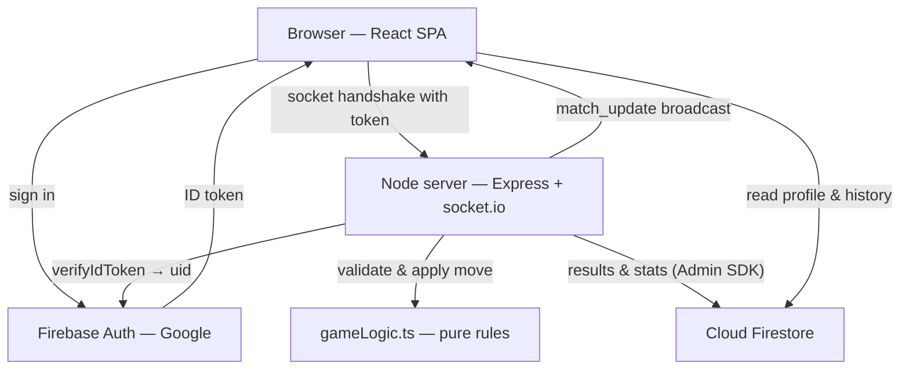

# Super Tic-Tac-Toe

Online two-player **Ultimate Tic-Tac-Toe** with Google sign-in, shareable game
codes, and a server-authoritative game engine.

Nine small boards sit inside one big board. The cell you play in decides which
board your opponent must play in next. Win three small boards in a line to win
the game.

---

## Features

- **Google sign-in** — no passwords, no sign-up form.
- **Real online multiplayer** — two people, two devices, two networks.
- **Shareable rooms** — a six-character code and a one-tap invite link.
- **Server-authoritative moves** — the browser can ask; only the server decides.
- **Refresh and reconnect recovery** — reload or lose Wi-Fi and the game is still there.
- **Two-sided rematch** — both players must agree, and the second player starts.
- **Play the computer** — minimax practice, kept out of your record.
- **Your record** — games, wins, losses, draws, and recent results.
- **Draw offers, resignation, and hints.**
- **Responsive and accessible** — works on a phone, keyboard-navigable, and
  never signals turn or winner by colour alone.

## Tech stack

| Layer    | Choice                                 | Why                                                                          |
| -------- | -------------------------------------- | ---------------------------------------------------------------------------- |
| UI       | React 19, React Router 7, Vite 6       | Already in the project and working well                                      |
| Styling  | Tailwind CSS 4                         | Existing "Dark Royal" palette preserved                                      |
| Motion   | Motion for React                       | Small, and already used                                                      |
| Realtime | socket.io 4 on Express 4               | Persistent connection; single process gives move atomicity for free          |
| Auth     | Firebase Auth (Google)                 | Free tier with no credit card, and pairs with Firestore                      |
| Data     | Cloud Firestore                        | One backend dependency instead of two                                        |
| Tests    | Vitest, Playwright, Firebase emulators | Unit, integration, security-rules and E2E                                    |
| Hosting  | Render                                 | The only genuinely free tier supporting persistent WebSockets without a card |

## Architecture



The server holds every live game in memory and is the only writer of game state.
Clients send an _intent_ (`make_move`), never a board. Node's single-threaded
event loop serialises those intents, which is what makes simultaneous moves and
double-clicks safe without any locking.

### Multiplayer flow

```
Sign in with Google
        ↓
Lobby ──► Create game ──► code + invite link ──► share
        │                                          ↓
        └──► Join with code ◄──────────────── opponent opens link
                        ↓
                  Game starts
                        ↓
        Realtime turns (server-validated)
                        ↓
              Win / draw / resign
                        ↓
            Rematch (both must agree)
```

### Authentication

1. The browser signs in with Google through the Firebase SDK.
2. Every socket connection attaches a **fresh** ID token, supplied through a
   callback so reconnects after the one-hour expiry still work.
3. `io.use()` middleware verifies the token with `firebase-admin` and stores the
   resulting `uid` on the socket.
4. **Every handler reads that `uid`. None reads an identity from its payload.**

That last point is the whole security model. Before this rewrite the client sent
its own `userId`, so any player could act as any other.

### Security model

| Threat                              | Defence                                                     |
| ----------------------------------- | ----------------------------------------------------------- |
| Playing as someone else             | `uid` derived from a verified token, never from the payload |
| Playing out of turn, or twice       | Turn checked against the verified mark on every move        |
| Illegal move via DevTools           | Server re-validates with the same `isValidMove` the UI uses |
| Resigning on your opponent's behalf | Resigning mark derived from the socket                      |
| A bystander ending someone's game   | Draw accept requires being the player who did _not_ offer   |
| Editing your own win count          | Firestore rules allow only `displayName` / `photoURL`       |
| Fabricating a match record          | `match_records` is not client-writable at all               |
| Reading another game's chat         | Chat requires membership of that match                      |
| Chat flooding                       | Five messages per ten seconds, per socket                   |
| Cross-origin socket abuse           | `CLIENT_ORIGIN` allowlist in production                     |

## Local setup

**Requirements:** Node 20+, Java 21+ (for the Firestore emulator).

```bash
cd app
npm install
```

Everything below runs against the **Firebase emulators**, so you do not need a
Firebase project to develop or test.

```bash
npm run dev:emulators
```

Then open the printed URL. To play against yourself, open a second **private**
window so the two sessions have different Google accounts.

To run against a real Firebase project instead, copy `.env.example` to `.env`
and fill it in, then `npm run dev`.

## Environment variables

See [`.env.example`](.env.example) for the full annotated list.

| Variable                   | Secret? | Purpose                                                          |
| -------------------------- | ------- | ---------------------------------------------------------------- |
| `VITE_FIREBASE_*`          | No      | Web config. Public identifiers that ship in the bundle by design |
| `FIREBASE_SERVICE_ACCOUNT` | **Yes** | Admin credential for verifying tokens and writing results        |
| `CLIENT_ORIGIN`            | No      | Comma-separated origins allowed to open a socket in production   |
| `PORT`                     | No      | Injected by the host                                             |

## Scripts

| Command                    | What it does                                        |
| -------------------------- | --------------------------------------------------- |
| `npm run dev`              | Dev server (Vite middleware + socket server)        |
| `npm run dev:emulators`    | The same, with the Firebase emulators               |
| `npm run build`            | Build the SPA and bundle the server                 |
| `npm start`                | Run the production build                            |
| `npm run lint`             | ESLint                                              |
| `npm run typecheck`        | `tsc --noEmit` (strict)                             |
| `npm test`                 | Unit tests                                          |
| `npm run test:integration` | Socket + security-rules tests against the emulators |
| `npm run test:e2e`         | Playwright end-to-end tests                         |
| `npm run test:all`         | All three suites                                    |
| `npm run format`           | Prettier                                            |

## Testing

| Suite       | Count | What it proves                                                                                                                                                                                                 |
| ----------- | ----- | -------------------------------------------------------------------------------------------------------------------------------------------------------------------------------------------------------------- |
| Unit        | 25    | The Ultimate TTT rules: sub-board wins, the forced sub-board, the free move when the target is decided, draws, immutability                                                                                    |
| Integration | 50    | Real sockets and real ID tokens: impersonation, out-of-turn and illegal moves, unauthorised resign/draw, unknown and full rooms, contested cells, reconnect. Plus 14 security-rules tests run as a real client |
| E2E         | 13    | Two browser contexts through the full stack: create → share → join → play → result → rematch, refresh recovery, and mobile layout                                                                              |

Sign-in is exercised through the **Auth emulator**. Automating Google's live
OAuth screens would be fragile and is not something to script.

## Deployment

The app is one Node process: Express serves the built SPA _and_ hosts the game
server, so it deploys as a single service.

[`render.yaml`](../render.yaml) in the repository root is a ready Render
Blueprint. Connect the repository in Render and it will pick it up.

**These steps need console access and cannot be automated:**

1. **Firebase console** → create a project (or reuse one).
2. **Authentication** → Sign-in method → enable **Google**.
3. **Authentication** → Settings → Authorised domains → add your Render domain
   (`your-app.onrender.com`). Without this, sign-in fails with
   `auth/unauthorized-domain`.
4. **Firestore Database** → create it in production mode.
5. **Project settings → Service accounts** → generate a private key. Paste the
   JSON as one line into Render's `FIREBASE_SERVICE_ACCOUNT` environment variable.
6. **Project settings → Your apps → Web** → copy the config values into the
   `VITE_FIREBASE_*` variables in Render.
7. Set `CLIENT_ORIGIN` to your Render URL.
8. Deploy the rules: `npx firebase deploy --only firestore:rules`.

> Render's free tier sleeps after 15 minutes with no traffic, so the first
> visitor after a quiet spell waits roughly a minute for a cold start. An
> occupied game keeps itself awake through the socket heartbeat.

## Project structure

```
app/
├── server/               # Authoritative game server
│   ├── index.ts          #   Express, socket.io, auth handshake, REST
│   ├── gameHandlers.ts   #   Socket events — every authorization check
│   ├── matchStore.ts     #   Rooms, codes, lifecycle, reaping
│   ├── persistence.ts    #   Firestore writes (Admin SDK)
│   ├── firebaseAdmin.ts  #   Token verification
│   └── env.ts            #   All environment access
├── src/
│   ├── gameLogic.ts      # Pure rules, shared by client and server
│   ├── aiEvaluator.ts    # Minimax bot and move grading
│   ├── features/
│   │   ├── auth/         #   AuthContext
│   │   └── game/         #   useSocket, useMatch, Board, protocol types
│   ├── pages/            # SignIn, Lobby, Game
│   ├── components/       # Spinner, ConnectionBanner, GoogleIcon
│   └── lib/firebase.ts   # Client SDK setup
└── tests/
    ├── unit/             # Game rules
    ├── integration/      # Sockets + security rules
    └── e2e/              # Playwright
```

## Troubleshooting

**"Port 8391 is not open" when running tests** — the Firestore emulator's Java
child sometimes survives shutdown on Windows. `npm run emulators:free` clears it,
and the test scripts already run it first.

**Sign-in fails with `auth/unauthorized-domain`** — add the domain under Firebase
Authentication → Settings → Authorised domains.

**Sockets refuse to connect with `AUTH_UNAVAILABLE`** — the server has no
`FIREBASE_SERVICE_ACCOUNT` and is not running against emulators. It refuses
rather than falling back to trusting the client.

**Everything loads but sign-in does nothing** — check the `VITE_FIREBASE_*`
variables. The sign-in screen says so explicitly when they are missing.

## Repository layout note

This repository is a university database course project. The `milestone 1/` to
`milestone 4/` folders hold the graded coursework — SQL schemas, ERDs, and
normalization documents — and are intentionally left untouched. All application
work lives under `app/`.

The pre-rewrite version of the app is preserved on the `archive/pre-v2-2026-09`
branch and the `pre-v2` tag.

## License

See [LICENSE](../LICENSE).
