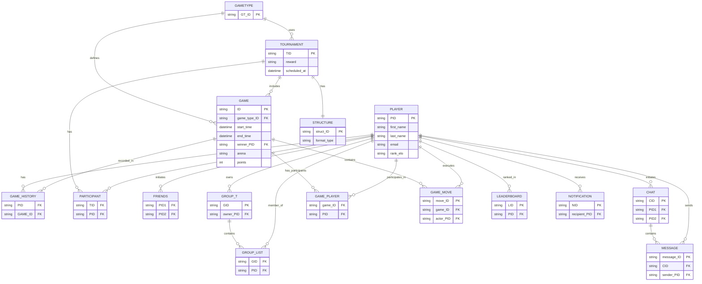

# Milestone 1 — System Design Overview

## Project Purpose

This database supports a **competitive gaming and tournament platform**. Players register, participate in tournaments, compete in games, earn Elo ratings, manage social connections (friends and groups), chat with each other, and receive system notifications. The platform tracks all game moves, tournament progression, and player rankings over time.

## Core Entities & Design Rationale

### **Accounts & Identity**
- **PLAYER**: Every registered user has a profile with credentials, Elo ranking, country, and activity status.
- **Why**: Supports user authentication, ranking, and profile management.

### **Games & Tournaments**
- **GAMETYPE**: Defines game modes (e.g., 3x3 Super Tic-Tac-Toe, 5x5 variant). Allows the platform to support multiple game types.
- **STRUCTURE**: Defines tournament formats (single elimination, round-robin, Swiss, ladder, etc.). Separates tournament rules from specific tournament instances.
- **TOURNAMENT**: A specific tournament instance with schedule, participants, rewards, and Elo entry requirements.
- **Why separate tables**: Different tournaments may use the same game type or structure; storing separately avoids duplication and allows rule reuse.

### **Game Execution & History**
- **GAME**: Records a completed game, including type, tournament, winner, start/end times, and arena.
- **GAME_PLAYER** (junction): Replaces the old fixed `P1_ID`, `P2_ID` columns. Allows flexible player participation (not just 2-player fixed games). Records player seat number and score.
- **GAME_MOVE**: Stores individual moves separately instead of a single "moves" text field. Enables move-by-move replay and analysis.
- **GAME_HISTORY** (junction): Records per-player game outcome (win/loss/draw/forfeit) and Elo change. Enables leaderboard calculations and match history queries.
- **Why junction tables**: Many-to-many relationships (one game has many players, one player plays many games) require junction tables for proper normalization.

### **Social Features**
- **GROUP_T** (group table): Player-created groups with membership.
- **GROUP_LIST** (junction): Tracks which players belong to which groups, join dates, and who invited them.
- **FRIENDS**: Stores friend connections between players, including who initiated the request and status.
- **Why junction tables**: Both represent many-to-many relationships that must be normalized.

### **Communication**
- **CHAT**: One conversation between two players. Separate row per unique player pair.
- **MESSAGE**: Individual messages within a chat. Supports threading via optional `reply_to` column.
- **Why separate tables**: A chat is a container; messages are the content. Allows querying chats separately from their message history.

### **Notifications & Ranking**
- **NOTIFICATION**: System notifications (friend requests, game results, tournament updates, rank changes).
- **LEADERBOARD**: Denormalized ranking snapshot (scope, rank_position, Elo at time of ranking). Enables fast leaderboard queries without aggregating `game_history`.

---

## Key Relationships

| Relationship | Type | Purpose |
|--------------|------|---------|
| Player → Game_Player ← Game | 1:M | Each game has multiple players via junction |
| Player → Game_History ← Game | 1:M | Track outcome and Elo change per player per game |
| Tournament → Participant ← Player | 1:M | Players enroll in tournaments |
| Player → Friends | M:M | Bidirectional friendship relationships |
| Player → Group_List ← Group | M:M | Players are members of groups |
| Chat → Message → Player | 1:M | Conversations contain messages; each message has a sender |
| Tournament → Structure | M:1 | Multiple tournaments can use same format |
| Tournament → GameType | M:1 | Multiple tournaments can use same game mode |

---

## Design Decisions

1. **No Fixed Player Columns in GAME**: Old design had `P1_ID`, `P2_ID` hard-coded, limiting games to 2 players. **GAME_PLAYER** junction allows flexible participation (2-player, 3-player, team, etc.).

2. **No Moves CSV in GAME**: Storing moves as text/CSV is not atomic (1NF violation). **GAME_MOVE** table stores one row per move, enabling queries like "all moves by player X in game Y."

3. **No Derived Totals in PLAYER**: Old design might include `wins_total`, `losses_total`, `draws_total`. These are derived from **GAME_HISTORY** and should never be stored (3NF violation, update anomalies).

4. **Separate GAME_HISTORY**: Stores outcome and Elo change per player per game. Enables query "player X's match history with Elo progression" without joining GAME_PLAYER multiple times.

5. **LEADERBOARD Table**: Denormalized for performance. Rank snapshots are calculated and inserted periodically, trading storage for query speed on a frequently-accessed metric.

---

## ER Diagram

