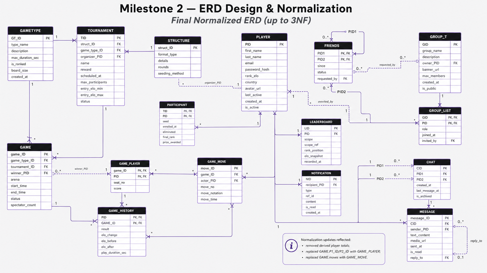

# Milestone 2 - ERD Design & Normalization

*Final Normalized ERD (up to 3NF) - Table Justification Report*

**Super Tic-Tac-Toe Database Schema**

> **Document objective**  
> This document justifies every table in the final normalized ERD by explaining its purpose, key choice, foreign-key role, dependencies, and why the table satisfies normalization up to Third Normal Form (3NF).

## Normalization basis

The final ERD is treated as the source of truth. The justification follows these normalization rules:

- **1NF:** each field stores an atomic value; repeating groups and multi-valued attributes are separated into child tables.

- **2NF:** in tables with composite keys, every non-key attribute depends on the full composite key, not only part of it.

- **3NF:** non-key attributes depend only on the key and not on other non-key attributes; derived totals and duplicated descriptive fields are avoided.

> **Important 3NF changes reflected in the ERD**  
> The final design removes derived player totals from PLAYER, replaces fixed GAME.P1_ID/P2_ID columns with GAME_PLAYER, and replaces the multi-valued GAME.moves attribute with GAME_MOVE.

## Entity overview

| Category | Tables | Why this category matters |
| --- | --- | --- |
| Reference / lookup | GAMETYPE, STRUCTURE | Stores reusable rule and format definitions without repeating them in events. |
| Core actor | PLAYER | Stores one row per account and is referenced across gameplay and social features. |
| Event records | TOURNAMENT, GAME | Stores scheduled competitions and individual match instances. |
| Associative tables | PARTICIPANT, GAME_PLAYER, GAME_HISTORY, FRIENDS, GROUP_LIST | Resolves many-to-many or self-referencing relationships while storing relationship-specific attributes. |
| Detail / log tables | GAME_MOVE, MESSAGE, NOTIFICATION, LEADERBOARD, CHAT, GROUP_T | Stores detailed activity, communication, group metadata, and snapshots in separate tables. |

## Final normalized ERD reference

*Figure 1. Final normalized ERD used for this table-by-table justification.*

## Table-by-table justification

Reading guide: Each table is justified by its key, dependency pattern, relationship role, and practical integrity constraints. The language “depends on the key” means the listed attributes are functionally determined by the table primary key and do not require duplicating data from another table.

### 1. GAMETYPE

**Purpose:** Stores the reusable definition of a game variant, such as the rules category, board size, time limit, and whether the variant is ranked.

| Primary key | GT_ID |
| --- | --- |
| Foreign keys / references | None. It is referenced by GAME.game_type_ID and TOURNAMENT.game_type_ID. |
| Core attributes | type_name, description, max_duration_sec, is_ranked, board_size, created_at. |
| 3NF justification | GT_ID determines every non-key attribute. The table contains only attributes that describe a game type, not attributes of any individual game, tournament, or player. Separating it prevents repeating the same rule details for every GAME or TOURNAMENT using that type. |
| Relationship rationale | One GAMETYPE can define many GAME records and many TOURNAMENT records. This makes the game type a lookup/reference table and removes transitive dependencies from those event tables. |
| Integrity notes | type_name should be unique when business rules require unique variant names. max_duration_sec and board_size should have positive-value checks. |

### 2. STRUCTURE

**Purpose:** Stores reusable tournament format information, such as bracket type, round count, and seeding method.

| Primary key | struct_ID |
| --- | --- |
| Foreign keys / references | None. It is referenced by TOURNAMENT.struct_ID. |
| Core attributes | format_type, details, rounds, seeding_method. |
| 3NF justification | struct_ID determines all non-key attributes. Tournament structure details are not repeated inside TOURNAMENT, so changing a reusable format does not require updating many tournament rows. No non-key attribute determines another non-key attribute within the table. |
| Relationship rationale | A tournament uses one structure, while one structure can be reused by many tournaments. This supports bracket reuse without duplicating bracket-format data. |
| Integrity notes | rounds should be validated as a non-negative or positive integer depending on whether a format can be open-ended. |

### 3. PLAYER

**Purpose:** Stores one account/profile row per registered player.

| Primary key | PID |
| --- | --- |
| Foreign keys / references | None in this table. PLAYER is referenced by tournament organization, participation, friendships, groups, chats, messages, leaderboard rows, notifications, and game records. |
| Core attributes | first_name, last_name, email, password_hash, rank_elo, country, avatar_url, last_active, created_at, is_active. |
| 3NF justification | PID determines each player attribute. Derived aggregates such as total_wins, total_losses, and total_draws were removed because they can be calculated from GAME_HISTORY. This avoids update anomalies after each completed game. |
| Relationship rationale | PLAYER is a central parent entity. Other tables store relationships to the player through foreign keys instead of repeating player names, emails, or other profile details. |
| Integrity notes | email should be unique. password_hash should store only hashed credentials. rank_elo is the current rating snapshot; historical rating changes belong in GAME_HISTORY. |

### 4. TOURNAMENT

**Purpose:** Stores one scheduled tournament instance and its high-level settings.

| Primary key | TID |
| --- | --- |
| Foreign keys / references | struct_ID -> STRUCTURE.struct_ID; game_type_ID -> GAMETYPE.GT_ID; organizer_PID -> PLAYER.PID. |
| Core attributes | name, reward, scheduled_at, max_participants, entry_elo_min, entry_elo_max, status. |
| 3NF justification | TID determines tournament-level attributes. Structure details, game-type rules, and organizer profile fields are not stored here; they are referenced through foreign keys. Player-specific enrollment attributes are moved to PARTICIPANT, and individual matches are stored in GAME. |
| Relationship rationale | A tournament uses one structure and one game type, is organized by one player, can include many games, and can have many participants through PARTICIPANT. |
| Integrity notes | entry_elo_min should be less than or equal to entry_elo_max when both are present. status should use a controlled set such as scheduled, active, completed, or canceled. |

### 5. PARTICIPANT

**Purpose:** Resolves the many-to-many relationship between TOURNAMENT and PLAYER and stores tournament-specific enrollment data.

| Primary key | Composite key: (TID, PID). |
| --- | --- |
| Foreign keys / references | TID -> TOURNAMENT.TID; PID -> PLAYER.PID. |
| Core attributes | seed, enrolled_at, eliminated, final_rank, prize_awarded. |
| 3NF justification | The non-key attributes depend on the full composite key, not on TID alone and not on PID alone. For example, a seed or final rank only makes sense for a particular player in a particular tournament. Player profile details and tournament settings are not duplicated here. |
| Relationship rationale | One tournament has many participant rows, and one player can enroll in many tournaments. The bridge table also supports tournament-specific state such as elimination and prize outcome. |
| Integrity notes | seed and final_rank can be constrained to be unique within a tournament when required. prize_awarded should be null until the player receives a prize. |

### 6. GAME

**Purpose:** Stores one actual match/game instance, optionally linked to a tournament.

| Primary key | game_ID |
| --- | --- |
| Foreign keys / references | game_type_ID -> GAMETYPE.GT_ID; tournament_ID -> TOURNAMENT.TID; winner_PID -> PLAYER.PID. |
| Core attributes | arena, start_time, end_time, status, spectator_count. |
| 3NF justification | game_ID determines game-level attributes. The design removes the prior P1_ID and P2_ID columns and replaces them with GAME_PLAYER, which removes repeating player-role columns and supports more flexible participation. The prior moves attribute is replaced with GAME_MOVE, so the game record no longer stores a multi-valued move list. |
| Relationship rationale | A game belongs to one game type and may belong to one tournament. It has player participation through GAME_PLAYER, moves through GAME_MOVE, and completed outcome rows through GAME_HISTORY. |
| Integrity notes | winner_PID should be null until a game is finished and should reference a player who appears in GAME_PLAYER for that game. end_time should be after start_time when both exist. |

### 7. GAME_PLAYER

**Purpose:** Resolves the many-to-many relationship between GAME and PLAYER and stores each player's seat and score in a specific game.

| Primary key | Composite key: (game_ID, PID). |
| --- | --- |
| Foreign keys / references | game_ID -> GAME.game_ID; PID -> PLAYER.PID. |
| Core attributes | seat_no, score. |
| 3NF justification | seat_no and score depend on the full composite key. They are not attributes of a player alone or a game alone; they describe a player's role and result within one game. This eliminates partial dependency and avoids fixed columns such as P1_ID/P2_ID. |
| Relationship rationale | One game can have multiple GAME_PLAYER rows, and one player can appear in multiple games. GAME_PLAYER is the authoritative table for who participated in a game. |
| Integrity notes | Add a unique constraint on (game_ID, seat_no) to prevent two players from occupying the same seat. A composite foreign key from GAME_MOVE(game_ID, actor_PID) to GAME_PLAYER(game_ID, PID) is recommended so only participants can make moves. |

### 8. GAME_MOVE

**Purpose:** Stores each atomic move made during a game.

| Primary key | move_ID |
| --- | --- |
| Foreign keys / references | game_ID -> GAME.game_ID; actor_PID -> PLAYER.PID, ideally constrained with game_ID through GAME_PLAYER. |
| Core attributes | move_no, move_notation, move_time. |
| 3NF justification | move_ID determines the move details. Storing moves as rows satisfies 1NF by removing the previous multi-valued GAME.moves attribute. Move order, notation, and timestamp belong to the move itself and are not stored as a repeated or concatenated list inside GAME. |
| Relationship rationale | A game has many moves, and each move is performed by one player. This allows replay, validation, auditing, and querying of the move sequence. |
| Integrity notes | Add a unique constraint on (game_ID, move_no). actor_PID should be checked against GAME_PLAYER so a non-participant cannot submit a move for the game. |

### 9. GAME_HISTORY

**Purpose:** Stores each player's completed-game result and Elo snapshot for a specific game.

| Primary key | Composite key: (PID, GAME_ID). |
| --- | --- |
| Foreign keys / references | PID -> PLAYER.PID; GAME_ID -> GAME.game_ID. |
| Core attributes | result, elo_change, elo_before, elo_after, play_duration_sec. |
| 3NF justification | The result and Elo values depend on the full player-game combination. They are not attributes of the player alone because the same player has many game results, and they are not attributes of the game alone because each player can have a different result and Elo change. Player and game descriptive data are not duplicated here. |
| Relationship rationale | GAME_HISTORY records the outcome side of participation after a game is completed, while GAME_PLAYER records seat/score state and GAME_MOVE records turn-by-turn detail. |
| Integrity notes | elo_after should normally equal elo_before plus elo_change according to application rules. Keeping elo_before and elo_after is justified as historical snapshot data, not as current PLAYER.rank_elo. |

### 10. FRIENDS

**Purpose:** Stores a friendship or friend request relationship between two player accounts.

| Primary key | Composite key: (PID1, PID2). |
| --- | --- |
| Foreign keys / references | PID1 -> PLAYER.PID; PID2 -> PLAYER.PID; requested_by -> PLAYER.PID. |
| Core attributes | since, status, requested_by. |
| 3NF justification | The non-key attributes depend on the friendship pair. status and since describe the relationship between PID1 and PID2, not either player by themselves. requested_by stores which player initiated the request without duplicating player data. |
| Relationship rationale | This is a self-referencing many-to-many relationship on PLAYER. A player can be connected to many other players, and each connection has relationship-specific status. |
| Integrity notes | Use a rule such as PID1 < PID2 or a unique unordered-pair constraint to prevent both (A, B) and (B, A). requested_by should be either PID1 or PID2. |

### 11. GROUP_T

**Purpose:** Stores group/community metadata.

| Primary key | GID |
| --- | --- |
| Foreign keys / references | owner_PID -> PLAYER.PID. |
| Core attributes | group_name, description, banner_url, max_members, created_at, is_public. |
| 3NF justification | GID determines all group-level attributes. Member-specific fields such as role and joined_at are not stored here; they are stored in GROUP_LIST. The owner is referenced by PID rather than duplicating owner profile data. |
| Relationship rationale | One group has one owner and many membership rows. GROUP_T represents the group itself, while GROUP_LIST represents the group-player membership relationship. |
| Integrity notes | group_name may be unique globally or unique per owner depending on business rules. max_members should be positive when present. |

### 12. GROUP_LIST

**Purpose:** Resolves the many-to-many relationship between GROUP_T and PLAYER and stores membership attributes.

| Primary key | Composite key: (GID, PID). |
| --- | --- |
| Foreign keys / references | GID -> GROUP_T.GID; PID -> PLAYER.PID; invited_by -> PLAYER.PID. |
| Core attributes | role, joined_at. |
| 3NF justification | role, joined_at, and invited_by depend on the full membership key. They are not properties of the group alone or the player alone. The table does not repeat group descriptions or player profile information. |
| Relationship rationale | A group can have many members, and a player can join many groups. The bridge table stores membership-specific state, including role and invitation source. |
| Integrity notes | role should use a controlled set such as owner, admin, moderator, or member. invited_by can be null for self-joined or owner-created memberships. |

### 13. CHAT

**Purpose:** Stores the header row for a direct chat conversation between two players.

| Primary key | CID |
| --- | --- |
| Foreign keys / references | PID1 -> PLAYER.PID; PID2 -> PLAYER.PID. |
| Core attributes | created_at, last_message_at, is_archived. |
| 3NF justification | CID determines conversation-level attributes. Individual message text, media, sender, and reply details are stored in MESSAGE, so the chat table does not contain repeating message data. PID1 and PID2 reference players instead of repeating account details. |
| Relationship rationale | One CHAT contains many MESSAGE rows. Each direct chat has two participant references to PLAYER. |
| Integrity notes | For strict normalization, last_message_at can be computed as MAX(MESSAGE.sent_at). If retained as a performance snapshot, it should be maintained by triggers or application logic. Use PID1 <> PID2 and a unique unordered-pair constraint if only one direct chat is allowed between two players. |

### 14. MESSAGE

**Purpose:** Stores each message sent within a chat conversation.

| Primary key | message_ID |
| --- | --- |
| Foreign keys / references | CID -> CHAT.CID; sender_PID -> PLAYER.PID; reply_to -> MESSAGE.message_ID. |
| Core attributes | text_content, media_url, sent_at, is_read. |
| 3NF justification | message_ID determines message content, media reference, timestamp, and read state. Chat-level data and sender profile details are not duplicated. The reply_to field is a self-referencing foreign key that points to another message rather than embedding reply content. |
| Relationship rationale | A chat has many messages, each message is sent by one player, and optional reply_to links support threaded replies. |
| Integrity notes | sender_PID should be one of the two chat participants. If future group chats or per-user read receipts are needed, is_read should move to a separate MESSAGE_READ table keyed by (message_ID, PID). |

### 15. LEADERBOARD

**Purpose:** Stores rank snapshots for a player within a particular leaderboard scope.

| Primary key | LID |
| --- | --- |
| Foreign keys / references | PID -> PLAYER.PID. |
| Core attributes | scope, scope_ref, rank_position, elo_snapshot, recorded_at. |
| 3NF justification | LID determines the snapshot attributes. Player account details remain in PLAYER. The snapshot is separate from PLAYER.rank_elo so historical leaderboard positions can be preserved without overwriting the current player rating. |
| Relationship rationale | One player can have many leaderboard rows across time and scope. scope and scope_ref define whether the record is global, tournament-specific, group-specific, or another application-defined scope. |
| Integrity notes | A recommended uniqueness rule is (scope, scope_ref, recorded_at, PID). rank_position should be positive. If scope_ref points to multiple table types, application rules must enforce that the referenced object matches scope. |

### 16. NOTIFICATION

**Purpose:** Stores individual notifications sent to a player.

| Primary key | NID |
| --- | --- |
| Foreign keys / references | recipient_PID -> PLAYER.PID. |
| Core attributes | type, ref_id, content, is_read, created_at. |
| 3NF justification | NID determines notification-specific attributes. The recipient is referenced by PID, and the notification does not duplicate the recipient profile or the full referenced object. type and ref_id identify the event or object the notification relates to. |
| Relationship rationale | One player can receive many notifications. Notifications can refer to games, messages, friend requests, groups, tournaments, or other objects using type and ref_id. |
| Integrity notes | For stronger referential integrity, polymorphic ref_id can be replaced by separate nullable foreign keys or by subtype notification tables. is_read is valid here because it is the read state of this notification for its single recipient. |

## Recommended constraints to preserve 3NF in implementation

- PLAYER.email should be unique to prevent duplicate accounts.

- FRIENDS should enforce PID1 <> PID2 and prevent duplicate unordered pairs.

- CHAT should enforce PID1 <> PID2 and, if the system allows only one direct chat per pair, enforce a unique unordered pair.

- GAME_PLAYER should enforce unique (game_ID, seat_no).

- GAME_MOVE should enforce unique (game_ID, move_no), and actor_PID should be validated as a participant in GAME_PLAYER.

- GAME.winner_PID should be null until completion and then should reference a participant in GAME_PLAYER.

- PARTICIPANT can enforce unique seed and unique final_rank within the same tournament where applicable.

- GROUP_LIST.role and TOURNAMENT.status should use controlled values.

- LEADERBOARD should use uniqueness rules such as (scope, scope_ref, recorded_at, PID) to prevent duplicate snapshots.

- If CHAT.last_message_at or GAME.spectator_count are retained as performance snapshots, they should be computed or maintained consistently so they do not create update anomalies.

## Conclusion

Overall, the final schema is normalized up to 3NF because reference data, core entities, associative relationships, logs, and snapshots are separated into focused tables. Multi-valued and repeating attributes are decomposed into child tables, composite-key tables store only relationship-specific attributes, and derived or duplicative attributes are either removed or explicitly treated as maintained snapshots.

---

**Markdown asset note:** The ERD image is referenced as `./final_normalized_erd.png`. Keep that image in the same folder as this Markdown file if you want the diagram to render.