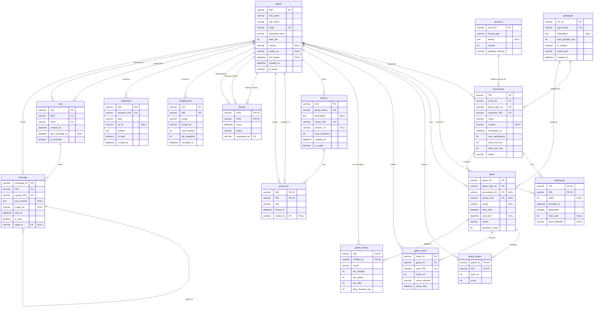

# Game Tournament Platform — Entity Relationship Diagram

```mermaid
erDiagram
    player {
        varchar PID PK
        varchar first_name
        varchar last_name
        varchar email UK
        varchar password_hash
        int rank_elo
        varchar country "NULL"
        varchar avatar_url "NULL"
        datetime last_active "NULL"
        datetime created_at
        boolean is_active
    }

    gametype {
        varchar GT_ID PK
        varchar type_name UK
        text description "NULL"
        int max_duration_sec
        boolean is_ranked
        varchar board_size
        datetime created_at
    }

    structure {
        varchar struct_ID PK
        varchar format_type
        text details "NULL"
        int rounds
        varchar seeding_method
    }

    tournament {
        varchar TID PK
        varchar struct_ID FK
        varchar game_type_ID FK
        varchar organizer_PID FK
        varchar name
        varchar reward "NULL"
        datetime scheduled_at
        int max_participants
        int entry_elo_min
        int entry_elo_max
        varchar status
    }

    participant {
        varchar TID PK,FK
        varchar PID PK,FK
        int seed "NULL"
        datetime enrolled_at
        boolean eliminated
        int final_rank "NULL"
        varchar prize_awarded "NULL"
    }

    game {
        varchar game_ID PK
        varchar game_type_ID FK
        varchar tournament_ID FK "NULL"
        varchar winner_PID FK "NULL"
        varchar arena "NULL"
        datetime start_time
        datetime end_time "NULL"
        varchar status
        int spectator_count
    }

    game_player {
        varchar game_ID PK,FK
        varchar PID PK,FK
        int seat_no
        int score
    }

    game_move {
        varchar move_ID PK
        varchar game_ID FK
        varchar actor_PID FK
        int move_no
        varchar move_notation
        datetime move_time
    }

    game_history {
        varchar PID PK,FK
        varchar GAME_ID PK,FK
        varchar result
        int elo_change
        int elo_before
        int elo_after
        int play_duration_sec
    }

    group_t {
        varchar GID PK
        varchar group_name UK
        text description "NULL"
        varchar owner_PID FK
        varchar banner_url "NULL"
        int max_members
        datetime created_at
        boolean is_public
    }

    group_list {
        varchar GID PK,FK
        varchar PID PK,FK
        varchar role
        datetime joined_at
        varchar invited_by FK "NULL"
    }

    friends {
        varchar PID1 PK,FK
        varchar PID2 PK,FK
        datetime since
        varchar status
        varchar requested_by FK
    }

    leaderboard {
        varchar LID PK
        varchar PID FK
        varchar scope
        varchar scope_ref
        int rank_position
        int elo_snapshot
        datetime recorded_at
    }

    notification {
        varchar NID PK
        varchar recipient_PID FK
        varchar type
        varchar ref_id "NULL"
        text content
        boolean is_read
        datetime created_at
    }

    chat {
        varchar CID PK
        varchar PID1 FK
        varchar PID2 FK
        datetime created_at
        datetime last_message_at "NULL"
        boolean is_archived
    }

    message {
        varchar message_ID PK
        varchar CID FK
        varchar sender_PID FK
        text text_content "NULL"
        varchar media_url "NULL"
        datetime sent_at
        boolean is_read
        varchar reply_to FK "NULL"
    }

    structure    ||--o{ tournament   : "defines format for"
    gametype     ||--o{ tournament   : "categorizes"
    player       ||--o{ tournament   : "organizes"

    tournament   ||--o{ participant  : "has"
    player       ||--o{ participant  : "enrolls as"

    gametype     ||--o{ game         : "typed as"
    tournament   ||--o{ game         : "contains"
    player       ||--o{ game         : "wins"

    game         ||--o{ game_player  : "includes"
    player       ||--o{ game_player  : "plays in"

    game         ||--o{ game_move    : "records"
    player       ||--o{ game_move    : "makes"

    player       ||--o{ game_history : "accumulates"
    game         ||--o{ game_history : "logged in"

    player       ||--o{ group_t      : "owns"
    group_t      ||--o{ group_list   : "has"
    player       ||--o{ group_list   : "member of"
    player       ||--o{ group_list   : "invites"

    player       ||--o{ friends      : "initiates (PID1)"
    player       ||--o{ friends      : "receives (PID2)"
    player       ||--o{ friends      : "requested by"

    player       ||--o{ leaderboard  : "ranked in"
    player       ||--o{ notification : "receives"

    player       ||--o{ chat         : "participant 1"
    player       ||--o{ chat         : "participant 2"

    chat         ||--o{ message      : "holds"
    player       ||--o{ message      : "sends"
    message      ||--o{ message      : "replies to"
```
